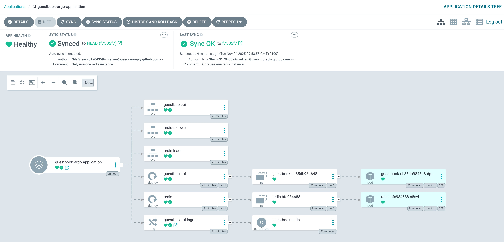
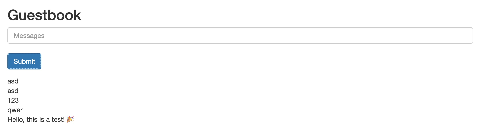
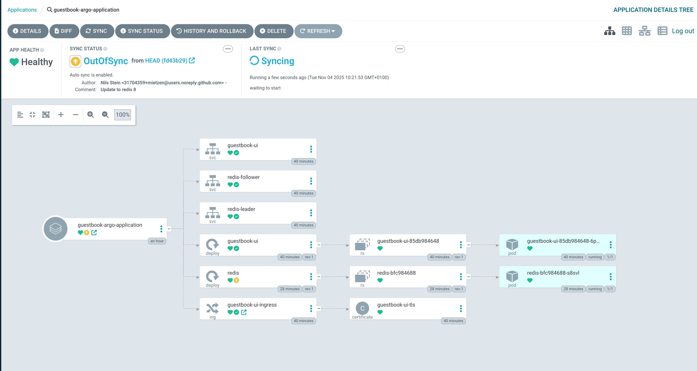

# Azure AKS - Argo CD Tutorial

In this tutorial, we’ll create an Azure AKS cluster and deploy Traefik, Cert-Manager, Argo CD, and the Kubernetes Guestbook example app. Argo CD is a GitOps-based deployment tool for Kubernetes, allowing you to manage application state through Git repositories. It continuously monitors your cluster and automatically applies updates when changes are pushed to Git, improving consistency, automation, and reliability in your CI/CD workflow.

## K8S Setup

First, we need a working Kubernetes setup.

### Create an AKS Cluster

**Prerequisites:**

We will need a Azure Account for this tutorial, If you don't have one, you can use the [30-Day Free Azure Account](https://azure.microsoft.com/en-us/pricing/purchase-options/azure-account). After registering, set up the [Azure CLI](https://learn.microsoft.com/en-us/cli/azure/install-azure-cli?view=azure-cli-latest) on your local machine and run `az login` to log in to your Azure account. Then setup `kubectl` by running `az aks install-cli`. We will also need [Helm](https://helm.sh/docs/intro/install/#through-package-managers) to be installed.

Later, we’ll also need a domain that we can point to our Kubernetes ingress. I’ll use my own, but you can easily use [DuckDNS](https://www.duckdns.org/) instead.

First we define some variables that we’ll use throughout the setup:

```shell
# Resource group name
RESOURCE_GROUP="rg-aks-argocd-demo"
# Azure region we want to use
LOCATION="westeurope"
# Azure AKS cluster name
AKS_NAME="aks-argocd-demo"
# Node size and count, we'll keep it as small as possible
# standard_a2_v2: 2 Cores, 4GB RAM
NODE_SIZE="standard_a2_v2"
NODE_COUNT=1
```

If this is a new subscription, we need to register the following resource providers for our Kubernetes cluster to work:

```shell
az provider register --namespace Microsoft.ContainerService
az provider register --namespace Microsoft.Insights
az provider register --namespace Microsoft.OperationalInsights
az provider register --namespace Microsoft.Network
```

This may take a few minutes. Check the registration status with:

```shell
az provider list -o json | jq '.[] | select((.namespace=="Microsoft.ContainerService") or (.namespace=="microsoft.insights") or (.namespace=="Microsoft.OperationalInsights") or (.namespace=="Microsoft.Network")) | "\(.namespace): \(.registrationState)"' -r
```

Now we can create a resource group:

```shell
az group create \
  --name $RESOURCE_GROUP \
  --location $LOCATION
```

And create our AKS cluster:

```shell
az aks create \
  --resource-group $RESOURCE_GROUP \
  --name $AKS_NAME \
  --node-vm-size $NODE_SIZE \
  --node-count $NODE_COUNT \
  --enable-managed-identity \
  --enable-aad \
  --enable-azure-rbac \
  --network-plugin azure \
  --network-policy azure \
  --enable-addons monitoring \
  --generate-ssh-keys
```

Wait for it to finish provisioning.

Congratulations — we’ve created a Kubernetes cluster 🎉

Next, we need to add the context to `kubectl`:

```shell
az aks get-credentials \
  --resource-group $RESOURCE_GROUP \
  --name $AKS_NAME
```

Since we’ve enabled Azure AD and Azure RBAC, we also need to add our user to the **Azure Kubernetes Service RBAC Cluster Admin** role:

```shell
USER_ID=$(az ad signed-in-user show --query id -o tsv)
az role assignment create \
  --assignee $USER_ID \
  --role "Azure Kubernetes Service RBAC Cluster Admin" \
  --scope $(az aks show --resource-group $RESOURCE_GROUP --name $AKS_NAME --query id -o tsv)
```

Wait a minute for the role assignment to propagate.

Now verify that we’re connected:

```shell
kubectl get nodes
kubectl get pods -A
```

The cluster is now ready for deployments.

### Create an Ingress

Before we can deploy Argo CD, we need to set up an ingress to reach it securely. We’ll use [Traefik](https://traefik.io/traefik) for this combined with [cert-manager](https://cert-manager.io/) for automate TLS certificate management.

Let’s start with `cert-manager`.

#### cert-manager

Create a namespace and deploy cert-manager:

```shell
kubectl create namespace cert-manager
helm install \
  cert-manager oci://quay.io/jetstack/charts/cert-manager \
  --version v1.19.1 \
  --namespace cert-manager \
  --create-namespace \
  --set crds.enabled=true
```

Next, we need to configure it. Create a new folder called `bootstrap` inside create another new folder called `ingress`. 

```
 bootstrap
 └── ingress
```

Now create a new file inside these folders, `bootstrap/ingress/cluster-issuer-staging.yaml` (replace the email address with your own):

```yaml
apiVersion: cert-manager.io/v1
kind: ClusterIssuer
metadata:
  name: letsencrypt-staging
spec:
  acme:
    server: https://acme-staging-v02.api.letsencrypt.org/directory
    email: postmaster@stack-dev.de  # replace!
    privateKeySecretRef:
      name: letsencrypt-staging-key
    solvers:
    - http01:
        ingress:
          class: traefik
```

Apply the configuration:

```shell
kubectl apply -f bootstrap/ingress/cluster-issuer-staging.yaml
```

Now, let’s deploy our Traefik ingress.

#### Traefik

Add the Helm repo, create a namespace, and deploy Traefik:

```shell
helm repo add traefik https://traefik.github.io/charts
helm repo update
kubectl create namespace traefik

helm install traefik traefik/traefik \
  --namespace traefik \
  --set ingressClass.enabled=true \
  --set ingressClass.isDefaultClass=true \
  --set service.type=LoadBalancer
```

After a successful deployment, we’ll need our public IP address:

```shell
kubectl get svc -n traefik traefik
```

Create a new DNS **A record** with the value of `EXTERNAL-IP`.
Mine for example is: [https://argocd.demo.k8s.stack-dev.de](https://argocd.demo.k8s.stack-dev.de)

Test it with:

```shell
nslookup argocd.demo.k8s.stack-dev.de
```

Now we can deploy Argo CD.

### Deploying Argo CD

We'll turn off auto redirect to https in Argo CD since we are using traefik as reverse proxy in front of it, therefore we need to create some files.
First create two new folders called `argocd`, inside of `bootstrap` and another inside of `argocd` called `argocd-kustomize`.

```
 bootstrap
 └── argocd
     └── argocd-kustomize
```

We create two new files, `bootstrap/argocd/argocd-kustomize/kustomization.yaml`:

```yaml
apiVersion: kustomize.config.k8s.io/v1beta1
kind: Kustomization
namespace: argocd

resources:
  - https://raw.githubusercontent.com/argoproj/argo-cd/stable/manifests/install.yaml

patches:
  - path: argocd-cmd-params-cm-patch.yaml
    target:
      kind: ConfigMap
      name: argocd-cmd-params-cm

```

and a file called `bootstrap/argocd/argocd-kustomize/argocd-cmd-params-cm-patch.yaml`:

```yaml
apiVersion: v1
kind: ConfigMap
metadata:
  name: argocd-cmd-params-cm
data:
  server.insecure: "true"
```

What we are doing here is patching the official install chart to set the default connection to http using [kustomize](https://github.com/kubernetes-sigs/kustomize).

Create a namespace and deploy it:

```shell
kubectl create namespace argocd
kubectl apply -k bootstrap/argocd/argocd-kustomize/
```

You can watch the deployment with:

```shell
kubectl get pods -n argocd -w
```

To reach it we need to create a ingress with a staging configuration for Argo CD to test our setup and avoid Let’s Encrypt rate limits.
Create a new file called `bootstrap/argocd/argocd-ingress.yaml`:


```yaml
apiVersion: networking.k8s.io/v1
kind: Ingress
metadata:
  name: argocd-server-ingress
  namespace: argocd
  annotations:
    cert-manager.io/cluster-issuer: "letsencrypt-staging"
    traefik.ingress.kubernetes.io/router.middlewares: traefik-redirect-to-https@kubernetescrd
spec:
  ingressClassName: traefik
  tls:
  - hosts:
    - argocd.demo.k8s.stack-dev.de # replace!
    secretName: argocd-server-tls
  rules:
  - host: argocd.demo.k8s.stack-dev.de # replace!
    http:
      paths:
      - path: /
        pathType: Prefix
        backend:
          service:
            name: argocd-server
            port:
              number: 80
```

Now we want to add a http to https redirect on our ingress, create a file called: `bootstrap/ingress/traefik-redirect-middleware.yaml`

```yaml
apiVersion: traefik.io/v1alpha1
kind: Middleware
metadata:
  name: redirect-to-https
  namespace: traefik
spec:
  redirectScheme:
    scheme: https
    permanent: true
```

Apply the staging config:

```shell
kubectl apply -f bootstrap/ingress/traefik-redirect-middleware.yaml
kubectl apply -f bootstrap/argocd/argocd-ingress.yaml
```

Check the certificate status:

```shell
kubectl get certificate -n argocd -w
```

Once all services show as `Running`, open the domain you configured earlier, e.g.:
[https://argocd.demo.k8s.stack-dev.de](https://argocd.demo.k8s.stack-dev.de)

**Note:** You’ll see a certificate warning because we’re still using a staging certificate.

Get the Argo CD admin password with:

```shell
kubectl -n argocd get secret argocd-initial-admin-secret -o jsonpath="{.data.password}" | base64 --decode && echo
```

You can now log in and change the password.

### Finalizing

Finally, we’ll replace the staging TLS certificate with a production one.

Create a file called `bootstrap/ingress/cluster-issuer-prod.yaml`:

```yaml
apiVersion: cert-manager.io/v1
kind: ClusterIssuer
metadata:
  name: letsencrypt
spec:
  acme:
    server: https://acme-v02.api.letsencrypt.org/directory
    email: postmaster@stack-dev.de  # replace!
    privateKeySecretRef:
      name: letsencrypt-prod-key
    solvers:
    - http01:
        ingress:
          class: traefik
```

Apply the production configuration:

```shell
kubectl apply -f bootstrap/ingress/cluster-issuer-prod.yaml
```

Then edit `bootstrap/argocd/argocd-ingress.yaml` and change `cert-manager.io/cluster-issuer` from `"letsencrypt-staging"` to `"letsencrypt"`:

```yaml
apiVersion: networking.k8s.io/v1
kind: Ingress
metadata:
  name: argocd-server-ingress
  namespace: argocd
  annotations:
    cert-manager.io/cluster-issuer: "letsencrypt"
    traefik.ingress.kubernetes.io/router.middlewares: traefik-redirect-to-https@kubernetescrd
spec:
  ingressClassName: traefik
  tls:
  - hosts:
    - argocd.demo.k8s.stack-dev.de # replace!
    secretName: argocd-server-tls
  rules:
  - host: argocd.demo.k8s.stack-dev.de # replace!
    http:
      paths:
      - path: /
        pathType: Prefix
        backend:
          service:
            name: argocd-server
            port:
              number: 80
```

Apply the updated configuration and delete the old certs:

```shell
# Delete the staging certificate and secret
kubectl delete certificate argocd-server-tls -n argocd
kubectl delete secret argocd-server-tls -n argocd
kubectl apply -f bootstrap/argocd/argocd-ingress.yaml
```

Check the certificate status:

```shell
kubectl get certificate -n argocd -w
```

Then visit your domain again, it should now have a valid TLS certificate (You might need to clear the cache).

## Using Argo CD

Now we can use Argo CD to deploy our first application.
For testing, we'll use the [Kubernetes Guestbook Example](https://kubernetes.io/docs/tutorials/stateless-application/guestbook/).

First, create a new DNS **A record** for our guestbook:
`guestbook.demo.k8s.stack-dev.de`

It should point to the same `EXTERNAL-IP`.

After creating the DNS entry, we need a git repository. Create one on e.g. GitHub and check in all files of your tutorial working directory.

### Preparing the Guestbook Application

Our guestbook application consists of a simple PHP frontend that stores data in Redis. We've adapted the official Kubernetes guestbook example to work with our AKS cluster.

The application structure looks like this:

```
app
└── guestbook
    ├── dev
    │   ├── guestbook-ingress.yaml
    │   ├── guestbook-ui-deployment.yaml
    │   ├── guestbook-ui-svc.yaml
    │   ├── kustomization.yaml
    │   ├── redis-deployment.yaml
    │   └── redis-svc.yaml
    └── application.yaml
```

Let's create all files:

- Argo CD Application definition: `app/guestbook/application.yaml`

```yaml
apiVersion: argoproj.io/v1alpha1
kind: Application
metadata:
  name: guestbook-argo-application
  namespace: argocd
spec:
  project: default

  source:
    repoURL: https://github.com/mietzen/AKS-ArgoCD-tutorial # Replace with your own repo!
    targetRevision: HEAD
    path: app/guestbook/dev
  destination:
    server: https://kubernetes.default.svc
    namespace: guestbook

  syncPolicy:
    syncOptions:
    - CreateNamespace=true

    automated:
      selfHeal: true
      prune: true
```

- Kustomize configuration: `app/guestbook/dev/kustomization.yaml`

```yaml
resources:
- guestbook-ui-deployment.yaml
- guestbook-ui-svc.yaml
- guestbook-ingress.yaml
- redis-deployment.yaml
- redis-svc.yaml

apiVersion: kustomize.config.k8s.io/v1beta1
kind: Kustomization
```

- Ingress definition: `app/guestbook/dev/guestbook-ingress.yaml`

```yaml
apiVersion: networking.k8s.io/v1
kind: Ingress
metadata:
  name: guestbook-ui-ingress
  namespace: guestbook
  annotations:
    cert-manager.io/cluster-issuer: "letsencrypt"
    traefik.ingress.kubernetes.io/router.middlewares: traefik-redirect-to-https@kubernetescrd
spec:
  ingressClassName: traefik
  tls:
  - hosts:
    - guestbook.demo.k8s.stack-dev.de # replace with your domain!
    secretName: guestbook-ui-tls
  rules:
  - host: guestbook.demo.k8s.stack-dev.de # replace with your domain!
    http:
      paths:
      - path: /
        pathType: Prefix
        backend:
          service:
            name: guestbook-ui
            port:
              number: 80
```

- Redis instance `app/guestbook/dev/redis-deployment.yaml`

```yaml
apiVersion: apps/v1
kind: Deployment
metadata:
  name: redis
  labels:
    app: redis
spec:
  replicas: 1
  selector:
    matchLabels:
      app: redis
  template:
    metadata:
      labels:
        app: redis
    spec:
      containers:
      - name: redis
        image: redis:7-alpine
        resources:
          requests:
            cpu: 50m
            memory: 64Mi
        ports:
        - containerPort: 6379
```

- Redis services (both leader and follower pointing to the same pod): `app/guestbook/dev/redis-svc.yaml`

```yaml
apiVersion: v1
kind: Service
metadata:
  name: redis-leader
  labels:
    app: redis
spec:
  ports:
  - port: 6379
    targetPort: 6379
  selector:
    app: redis
---
apiVersion: v1
kind: Service
metadata:
  name: redis-follower
  labels:
    app: redis
spec:
  ports:
  - port: 6379
    targetPort: 6379
  selector:
    app: redis
```

**Note:** We create both `redis-leader` and `redis-follower` services pointing to the same Redis pod because the guestbook frontend expects both service names (writes go to leader, reads go to follower). This simplified setup is due to our development environment with limited resources.

After creating all these files, add, commit and push them to your GitHub Repo.

### Deploying the Application

To deploy our application definition to Argo CD we need to use `kubectl apply` one last time:

```shell
kubectl apply -f app/guestbook/application.yaml
```

You can now go to your Argo CD instance, e.g. [https://argocd.demo.k8s.stack-dev.de](https://argocd.demo.k8s.stack-dev.de) and check out the deployment:



You should see:

- One `guestbook-ui` deployment (with a replicaset and a pod)
- One `redis` deployment (with a replicaset and a pod)
- Services:
  - `guestbook-ui`
  - `redis-leader`
  - `redis-follower`
- Ingress: `guestbook-ui-ingress`
  - Certificate: `guestbook-ui-tls`

### Accessing the Guestbook

Once all pods are running and the certificate is ready, visit your guestbook e.g.: [https://guestbook.demo.k8s.stack-dev.de](https://guestbook.demo.k8s.stack-dev.de)



You should see the guestbook interface where you can:

- Submit messages
- View all submitted messages
- See messages persist in Redis

### Making Changes

Thanks to Argo CD's GitOps approach, any changes you push to your Git repository will automatically be synced to the cluster (due to `selfHeal: true` and `prune: true` in the sync policy).

To make changes:

1. Edit the YAML files in `app/guestbook/dev/`
2. Commit and push to your repository
3. Argo CD will detect the changes and automatically sync
4. Watch the sync in the Argo CD UI

In a real GitOps setup, changes would normally go through a pull request, review, and automated validation process before being merged. Updates are often deployed to staging first, then promoted to production using the same Git workflow. While this tutorial keeps things simple, these practices enable safer, traceable, and fully automated deployments.

But you can test this by e.g. changing the redis image from `redis:7-alpine` to `redis:8-alpine`. After you push this change you can watch Argo CD pick up that change and deploy a new redis instance.



Congratulations! You've successfully deployed a GitOps-managed application on AKS using Argo CD 🎉

## Delete all

If you are finished testing, you can delete the cluster and local configuration executing the following code.

Remove user, cluster and context from `kubectl` config:

```shell
KUBECTL_USER=$(kubectl config get-users | grep "${RESOURCE_GROUP}_${AKS_NAME}")
kubectl config delete-cluster "$AKS_NAME"
kubectl config unset users."$KUBECTL_USER"
kubectl config delete-context "$AKS_NAME"
```

To remove the whole resource group including the cluster:

```shell
az group delete --name $RESOURCE_GROUP --yes
```

## Resources

- [Kubernetes Guestbook Example](https://kubernetes.io/docs/tutorials/stateless-application/guestbook/)
- [Argo CD Tutorial for Beginners](https://www.youtube.com/watch?v=MeU5_k9ssrs)
- [Argo CD documentation](https://argo-cd.readthedocs.io/en/stable/)
- [traefik documentation](https://doc.traefik.io/traefik/)
